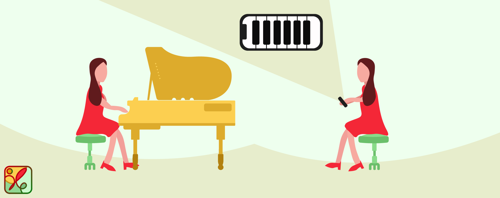

<h1 style="font-size:80px" align="center"> Musarise</h1>

<p align="center">Uma aplicação <i>IOS</i> que traz toda a experiência de produção de uma música até você!</p> 

<p align="center">
<a href="https://formulae.brew.sh/formula/semgrep">

</a>
</p>

<h2> Features </h2>

* [📱 Rede social](#redeSocial)
* [🎵 Instrumentos](#instrumentos)

<a name="redeSocial"><h2>📱 Rede social</h2></a>

```
TODO
```

<a name="instrumentos"><h2>🎵 Instrumentos</h2></a>

### Bateria

O **sensor acelerómetro** é utilizado para criar o som da **bateria**. Esse sensor mede as acelerações do dispositivo em diferentes direções, permitindo detetar o momento em que a batida é tocada e a intensidade dos golpes dados na bateria virtual. A aplicação disponibiliza 5 tipos de sons diferentes -- 1 *floor tom*, 1 *rack tom* e 2 *crash cymbal*, todos extraídos a partir da plataforma *online* [Virtual Drumming](https://www.virtualdrumming.com/drums/online-virtual-games/online-virtual-games-drums.html).

A estratégia adotada para a reprodução do som da bateria baseia-se na análise da variação do sinal da aceleração, tendo em conta a sua polaridade. No processo de execução, quando a baqueta começa o seu movimento descendente em direção ao instrumento, os valores da aceleração são registados como positivos. No entanto, à medida que se aproxima do ponto de impacto, ocorre uma transição para valores negativos, sendo este intervalo crucial para determinar o volume sonoro. Quanto mais rápido for esse intervalo de tempo em que a aceleração é negativa, maior será a intensidade resultante. Este intervalo termina assim que aceleração voltar a ser positiva, representando este o momento em que a baqueta se eleva e se afasta do instrumento. A figura seguinte ilustra a posição que o dispositivo deve assumir para a concretização do processo descrito.


No contexto da bateria virtual, existem dois modos possíveis de reprodução: o modo simples e o modo livre. No <ins>modo simples</ins>, é apenas tocado um dos 5 sons disponíveis ao longo da simulação. Em contrapartida, o <ins>no modo livre</ins>, já não inclui uma seleção pré-definida de um som. Em vez disso, existem 3 partes da bateria em posições diferentes. A ideia é que, ao mover-se mais para a direita, esquerda ou centro, o resultado gerado varia de acordo com a tal parte do instrumento que se encontra nessa posição. Esta abordagem proporciona uma experiência mais realista e expressiva à simulação.

### Guitarra

O sensor giroscópio é utilizado para a criação do som da guitarra. Tal sensor mede a taxa de variação na qual um dispositivo gira em torno de um eixo espacial. Ou seja, é medida a velocidade angular do dispositivo. Os valores de rotação são medidos em radianos por segundo em torno do eixo específico. Os valores de rotação podem ser positivos ou negativos, dependendo da direção da rotação.  O movimento considerado para a simulação da guitarra foi aquele que é gerado pela mão que segura a palheta. Isto é, a aplicação reproduz a mão que realiza o "ritmo" do som.  A figura seguinte mostra o movimento de rotação simulado pela aplicação.


Para produzir o som da guitarra, foram consideradas as seis notas correspondentes às cordas soltas (Mi, Lá, Ré, Sol, Si e Mi), tocadas individualmente, sem a formação de acordes. É como se apenas a mão do "ritmo" fosse considerada. Os sons de cada nota foram obtidos a partir da plataforma [Recursive Arts](https://recursivearts.com/online-guitar/).

O mecanismo por trás da reprodução dos sons das notas segue o seguinte princípio: *a intensidade da variação da rotação reflete na quantidade de notas tocadas*. Quanto maior a variação obtida, mais notas são emitidas. Deste modo, foi preciso apenas determinar qual seria a variação detectada que iria corresponder a reprodução das seis notas de uma vez. A partir deste valor, através de uma regra de três simples, pode-se  obter o número de notas que devem ser reproduzidas a partir da variação de rotação atual. 

As seis notas são armazenadas numa lista (seguindo a ordem "de cima para baixo" da guitarra). Para além disto, é também conhecida a última nota tocada. Assim, a partir do mecanismo de obtenção da **quantidade de notas a serem tocadas** juntamente com a **direção do movimento**, podemos saber quais as notas que devem ser tocadas (acessando **n** notas a frente ou anterioriores a última nota tocada) e de seguida atualizar a última nota reproduzida. 

### Piano

O **sensor de *touch*** é usado para recolher o toque do usuário nas 6 teclas virtuais do piano. Os sons de cada tecla foram conseguidos através da plataforma [Recursive Arts](https://recursivearts.com/virtual-piano/). Quanto mais suave for o toque, melhor será a resposta às variações de pressão exercidas e, consequentemente, mais precisa será a sequência de sons produzida. Esta funcionalidade é preciosa para aspirantes a pianista que, com a capacidade de se expressarem musicalmente através de um toque, podem criar uma experiência interessante de tocar piano.



### Voice

O **sensor do microfone** é utilizado para a captação do áudio do utilizador. Quanto mais perto da boca do utilizador, melhor as ondas sonoras são captadas pelo sensor. O objetivo desta *feature* é permitir o utilizador sentir-se como o cantor de uma banda.


<h2> 👥 Equipa </h2>


- <a href="https://github.com/sailoring-rgb">Ana Henriques</a>
- <a href="https://github.com/LittleLevi05">Henrique Costa</a>
