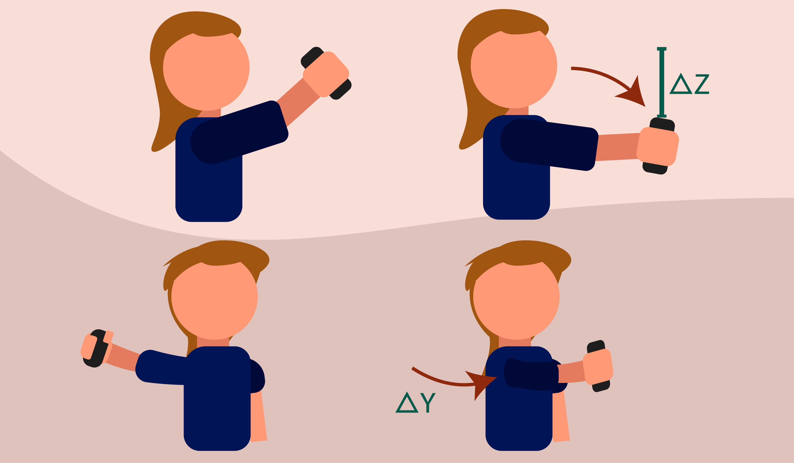

<h1 style="font-size:80px" align="center"> Musarise</h1>

<p align="center">Uma aplicação <i>IOS</i> que traz toda a experiência de produção de uma música até você!</p> 

<p align="center">
<a href="https://formulae.brew.sh/formula/semgrep">

</a>
</p>

<h2> Features </h2>

* [📱 Rede social](#redeSocial)
* [🎵 Instrumentos](#instrumentos)

<a name="redeSocial"><h2>📱 Rede social</h2></a>

```
TODO
```

<a name="instrumentos"><h2>🎵 Instrumentos</h2></a>

### Bateria

#### **Modo 1**

O movimento é **livre**. O som da bateria será produzido se for detetada apenas variações no **eixo z**. Aqui, as variações no eixo **x** e **y** apenas servem para alternar o som da bateria. Porém, se o movimento atual for muito parecido (em termos de variações de **x** e **y**) com o previamente feito, então o som será igual ao anterior.



#### **Modo 2**

```
TODO
``` 

### Guitarra

```
TODO
```

### Piano

```
TODO
```

<h2> 👥 Equipa </h2>


- <a href="https://github.com/sailoring-rgb">Ana Henriques</a>
- <a href="https://github.com/LittleLevi05">Henrique Costa</a>
