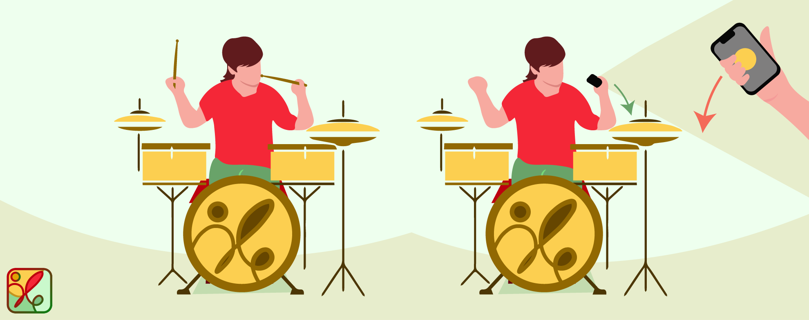
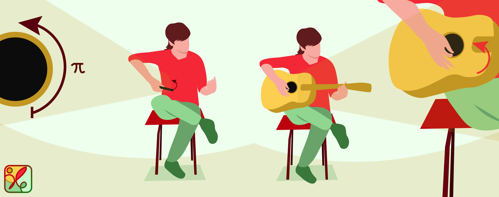

<h1 style="font-size:80px" align="center"> Musarise</h1>

<p align="center">Uma aplicação <i>IOS</i> que traz toda a experiência de produção de uma música até você!</p> 

<p align="center">
<a href="https://formulae.brew.sh/formula/semgrep">

</a>
</p>

<h2> Features </h2>

* [📱 Rede social](#redeSocial)
* [🎵 Instrumentos](#instrumentos)

<a name="redeSocial"><h2>📱 Rede social</h2></a>

```
TODO
```

<a name="instrumentos"><h2>🎵 Instrumentos</h2></a>

### Bateria

```
TODO
```




```
TODO
``` 

### Guitarra

O sensor giroscópio é utilizado para a criação do som da guitarra. Tal sensor mede a taxa de variação na qual um dispositivo gira em torno de um eixo espacial. Ou seja, é medida a velocidade angular do dispositivo. Os valores de rotação são medidos em radianos por segundo em torno do eixo específico. Os valores de rotação podem ser positivos ou negativos, dependendo da direção da rotação.  O movimento considerado para a simulação da guitarra foi aquele que é gerado pela mão que segura a palheta. Isto é, a aplicação reproduz a mão que realiza o "ritmo" do som.  A figura seguinte mostra o movimento de rotação simulado pela aplicação.




Para produzir o som da guitarra, foram consideradas as seis notas correspondentes às cordas soltas (Mi, Lá, Ré, Sol, Si e Mi), tocadas individualmente, sem a formação de acordes. É como se apenas a mão do "ritmo" fosse considerada. Os sons de cada nota foram obtidos a partir da plataforma [Recursive Arts](https://recursivearts.com/online-guitar/).

O mecanismo por trás da reprodução dos sons das notas segue o seguinte princípio: *a intensidade da variação da rotação reflete na quantidade de notas tocadas*. Quanto maior a variação obtida, mais notas são emitidas. Deste modo, foi preciso apenas determinar qual seria a variação detectada que iria corresponder a reprodução das seis notas de uma vez. A partir deste valor, através de uma regra de três simples, pode-se  obter o número de notas que devem ser reproduzidas a partir da variação de rotação atual. 

As seis notas são armazenadas numa lista (seguindo a ordem "de cima para baixo" da guitarra). Para além disto, é também conhecida a última nota tocada. Assim, a partir do mecanismo de obtenção da **quantidade de notas a serem tocadas** juntamente com a **direção do movimento**, podemos saber quais as notas que devem ser tocadas (acessando **n** notas a frente ou anterioriores a última nota tocada) e de seguida atualizar a última nota reproduzida. 

### Piano

```
TODO
```

<h2> 👥 Equipa </h2>


- <a href="https://github.com/sailoring-rgb">Ana Henriques</a>
- <a href="https://github.com/LittleLevi05">Henrique Costa</a>
